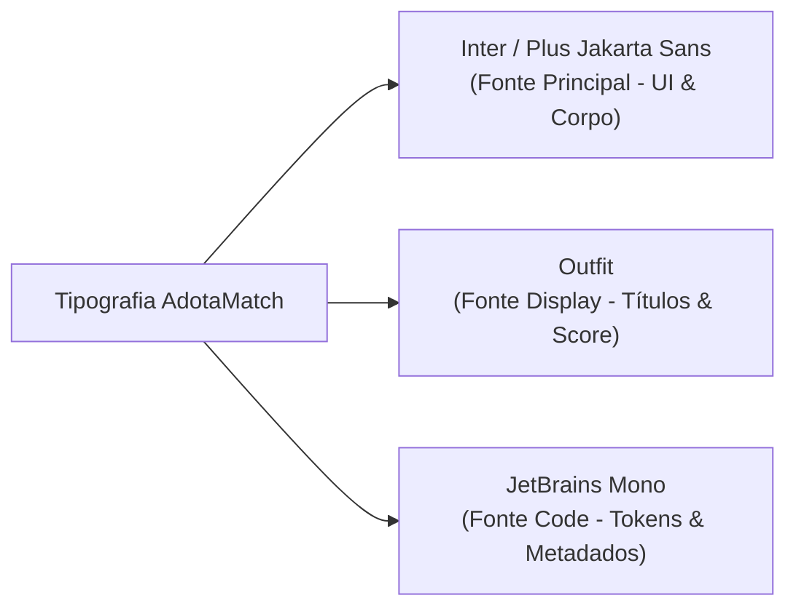

# Especificação 06 — Design System, Tipografia e Paleta de Cores
## Projeto AdotaMatch — TLC Spec-Driven Development | PrimeVue + Tailwind CSS

---

## 1. Fundamentos da Identidade Visual

O **Design System do AdotaMatch** foi concebido para materializar a proposta central do projeto de TCC: **unir empatia, acolhimento socioanimal e rigor da Ciência da Computação**.

A interface do sistema não atua como uma mera vitrine comercial, mas como um **ambiente de conscientização e tomada de decisão responsável**. Por esse motivo, a tipografia e a paleta de cores foram intencionalmente modeladas para:
* Transmitir clareza absoluta na leitura de dados comportamentais.
* Destacar visualmente o percentual de compatibilidade calculado pelo motor híbrido.
* Diferenciar de forma nítida os **Fatores de Afinidade** (convergência de rotina) dos **Alertas de Manejo e Desafios de Adaptação** (prevenção ativa de devoluções e reabandono).

O sistema ancora-se na integração entre a biblioteca de componentes acessíveis **PrimeVue (tema Aura)** e o framework utilitário **Tailwind CSS v4**.

---

## 2. Tipografia Oficial do AdotaMatch

### 2.1 Famílias de Fontes Homologadas



1. **Fonte Principal de Interface (`font-sans`):** **Inter** (com fallback para *Plus Jakarta Sans* e *system-ui*).
   * **Justificativa:** Desenvolvida especificamente para telas de computador e dispositivos móveis, com altura de x (x-height) generosa, proporções neutras e excelente legibilidade em formulários complexos, inputs e tabelas.
2. **Fonte Display / Títulos (`font-heading`):** **Outfit**.
   * **Justificativa:** Tipografia geométrica e contemporânea com vértices suaves, transmitindo modernidade, calor humano e proximidade afetiva. Utilizada em títulos de impacto e no destaque numérico do percentual de compatibilidade.
3. **Fonte Monoespacial (`font-mono`):** **JetBrains Mono**.
   * **Justificativa:** Clareza visual impecável para representação de dados brutos de inferência da LLM, tokens de auditoria e métricas técnicas da matriz de confusão.

---

### 2.2 Escala Tipográfica (Typography Scale)

| Nível / Token | Tamanho (px / rem) | Line-Height | Peso (Weight) | Tracking (Letter-Spacing) | Aplicação no AdotaMatch | Classe Tailwind |
| :--- | :--- | :--- | :--- | :--- | :--- | :--- |
| **Display Hero** | `48px` / `3.00rem` | `1.15` (56px) | Bold `800` | `-0.025em` (tight) | Título principal da Hero Section e percentual de compatibilidade em destaque | `text-5xl font-extrabold tracking-tight` |
| **Heading 1 (H1)** | `36px` / `2.25rem` | `1.20` (44px) | Bold `700` | `-0.025em` (tight) | Títulos das telas principais (`/match`, `/pets`) | `text-4xl font-bold tracking-tight` |
| **Heading 2 (H2)** | `28px` / `1.75rem` | `1.25` (36px) | Bold `700` | `-0.02em` | Títulos de formulários e seções de resultados | `text-3xl font-bold` |
| **Heading 3 (H3)** | `22px` / `1.375rem`| `1.30` (28px) | SemiBold `600` | `-0.015em` | Nome do animal no `MatchCard` e títulos de diálogos | `text-2xl font-semibold` |
| **Heading 4 (H4)** | `18px` / `1.125rem`| `1.35` (24px) | SemiBold `600` | `0em` (normal) | Subtítulos de agrupamento e cabeçalhos de alertas | `text-lg font-semibold` |
| **Body Large** | `18px` / `1.125rem`| `1.60` (28px) | Regular `400` | `0em` | Parágrafos introdutórios e orientações de tela | `text-lg font-normal leading-relaxed` |
| **Body Base (Padrão)**| `16px` / `1.00rem` | `1.50` (24px) | Regular `400` / Med `500` | `0em` | Textos gerais, inputs do PrimeVue (`Select`, `Textarea`), labels | `text-base font-normal` |
| **Body Small** | `14px` / `0.875rem`| `1.45` (20px) | Regular `400` / Med `500` | `0em` | Listas de justificativas explicativas e avisos de rodapé | `text-sm font-normal` |
| **Caption / Tag** | `12px` / `0.75rem` | `1.30` (16px) | SemiBold `600` / Bold `700` | `+0.02em` (wide) | Tags de espécie (`Cão`/`Gato`), porte, status do abrigo e badges | `text-xs font-semibold tracking-wide` |
| **Code / Tokens** | `13px` / `0.812rem`| `1.40` (18px) | Medium `500` | `0em` | Representação de esquemas JSON, tokens da LLM e logs de auditoria | `font-mono text-xs font-medium` |

---

## 3. Paleta de Cores e Tokens Semânticos

A paleta de cores combina os valores de referência do tema **Aura do PrimeVue** com a escala cromática do **Tailwind CSS**, obedecendo aos critérios de contraste **WCAG 2.1 nível AA** para garantir acessibilidade universal.

### 3.1 Primary Brand (Índigo) — Identidade, Conexão e Inteligência
Representa serenidade, confiança e a seriedade científica do projeto.
* `Primary 50`: `#eef2ff` — Fundo de badges sutis e foco suave.
* `Primary 100`: `#e0e7ff` — Fundo de avatares e contêineres secundários.
* `Primary 200`: `#c7d2fe` — Bordas de campos em estado de destaque.
* `Primary 500`: `#6366f1` — Cor base da identidade visual (Aura Primary).
* `Primary 600`: `#4f46e5` — **Ações Principais (Botões de cálculo e botões de chamada primária)**.
* `Primary 700`: `#4338ca` — Estado `:hover` de botões e links principais.
* `Primary 900`: `#312e81` — Texto escuro com tonalidade de marca.

### 3.2 Success / Affinity (Esmeralda) — Fatores Positivos de Compatibilidade
Empregado exclusivamente para evidenciar **pontos fortes de alinhamento** entre o adotante e o animal.
* `Success 50`: `#ecfdf5` — Fundo do card de afinidade (`bg-emerald-50/80`).
* `Success 100`: `#d1fae5` — Preenchimento de badges de alta afinidade.
* `Success 200`: `#a7f3d0` — Borda suave do banner de afinidade (`border-emerald-200`).
* `Success 500`: `#10b981` — Ícones de confirmação (`pi pi-check-circle`).
* `Success 700`: `#047857` — **Texto dos fatores de convergência (garante legibilidade estrita)**.
* `Success 800`: `#065f46` — Títulos internos de afinidade.

### 3.3 Warning / Preventive Alerts (Âmbar) — Conscientização contra Devolução
O elemento de maior relevância social da interface: chama a atenção do adotante para **desafios práticos e exigências de manejo**, combatendo o reabandono por frustração de expectativas.
* `Warning 50`: `#fffbeb` — Fundo do card de alerta preventivo (`bg-amber-50/80`).
* `Warning 100`: `#fef3c7` — Fundo de badges de advertência leve.
* `Warning 200`: `#fde68a` — Borda do banner de conscientização (`border-amber-200`).
* `Warning 500`: `#f59e0b` — Ícones de advertência (`pi pi-exclamation-triangle`).
* `Warning 700`: `#b45309` — Texto descritivo dos alertas preventivos.
* `Warning 900`: `#78350f` — Títulos e ênfases dos desafios de adaptação.

### 3.4 Danger / Hard Constraints (Vermelho Coral) — Incompatibilidade Crítica
Utilizado para restrições rígidas que invalidam a recomendação ($R(u, a) = 0$).
* `Danger 50`: `#fef2f2` — Mensagens de impedimento de adoção.
* `Danger 500`: `#ef4444` — Ícones de erro e restrição habitacional impeditiva.
* `Danger 700`: `#b91c1c` — Textos explicativos de impedimento sanitário ou comportamental.

### 3.5 Neutrals & Surfaces (Slate) — Estrutura e Superfícies
* `Surface 0`: `#ffffff` — Cards, modais e contêineres principais.
* `Surface 50`: `#f8fafc` — Fundo geral da página (`body bg-slate-50`).
* `Surface 100`: `#f1f5f9` — Fundo de inputs e cabeçalhos de tabela.
* `Surface 200`: `#e2e8f0` — Bordas estruturais padronizadas.
* `Surface 400`: `#94a3b8` — Textos desabilitados e placeholders.
* `Surface 600`: `#475569` — Textos de apoio e metadados secundários.
* `Surface 900`: `#0f172a` — **Texto principal de alta legibilidade (`text-slate-900`)**.

---

## 4. Sistema de Espaçamentos, Bordas e Sombras (8pt Grid)

### 4.1 Escala de Espaçamento
* `4px` (`0.25rem` / `gap-1`, `p-1`): Espaçamento interno mínimo entre ícones e rótulos.
* `8px` (`0.50rem` / `gap-2`, `p-2`): Espaçamento entre badges e metadados.
* `12px` (`0.75rem` / `gap-3`, `p-3`): Espaçamento entre itens de listas explicativas.
* `16px` (`1.00rem` / `gap-4`, `p-4`): Padding interno padrão de cards e alertas.
* `24px` (`1.50rem` / `gap-6`, `p-6`): Espaçamento entre colunas de formulários e cabeçalhos.
* `32px` (`2.00rem` / `gap-8`, `p-8`): Separação entre blocos macro de conteúdo.
* `48px` (`3.00rem` / `py-12`): Margem vertical de seções de destaque.

### 4.2 Raios de Borda (Border Radius)
* `rounded-md` (`6px`): Tags e badges compactas.
* `rounded-xl` (`12px`): Botões, inputs do PrimeVue, caixas de alerta.
* `rounded-2xl` (`16px`): Cards principais (`MatchCard`, contêineres de formulário).
* `rounded-full` (`9999px`): Avatares e selos circulares.

### 4.3 Sombras e Elevações (Shadows)
* `shadow-xs`: Bordas sutis da barra de navegação (`navbar`).
* `shadow-sm`: Estado repousado do `MatchCard`.
* `shadow-md`: Estado `:hover` de cards de animais (indica interatividade).
* `shadow-lg`: Diálogos modais e menus suspensos do PrimeVue.

---

## 5. Modelagem de Componentes do Core de Recomendação

### 5.1 O MatchCard com Explicabilidade Preventiva
O componente central de visualização de resultados estrutura-se hierarquicamente:

```txt
┌────────────────────────────────────────────────────────────────────────┐
│ [Avatar/Letra]  Caramelo  [Tag: Cão] [Tag: Porte Médio]    [Score 88%] │
│                 Sob custódia: ONG Amor de Patas (Ubá - MG)             │
├────────────────────────────────────────────────────────────────────────┤
│ ✓ Fatores de Afinidade (Por que este animal combina com sua rotina):   │
│   • Rotina de home office ideal para a companhia contínua.             │
│   • Interesse por caminhadas diárias alinhado à energia nível 3.       │
│   • Histórico atestado de afeto e tolerância com crianças.             │
├────────────────────────────────────────────────────────────────────────┤
│ ⚠ Alertas de Manejo e Desafios (Atenção para Adoção Responsável):      │
│   • Exige enriquecimento ambiental para não latir em períodos sozinho. │
│   • Sensível a trovões e fogos; reserve espaço protegido dentro de casa│
│   • Reserve os primeiros 30 dias para a fase de adaptação e vínculo.   │
├────────────────────────────────────────────────────────────────────────┤
│                                 [Botão: Manifestar Interesse Responsável]│
└────────────────────────────────────────────────────────────────────────┘
```

---

## 6. O Arquivo de Modelagem `.pen` (`adotamatch-design-system.pen`)

A especificação visual foi integralmente codificada no arquivo vetorial estruturado:
📄 **[`adotamatch/design/adotamatch-design-system.pen`](file:///c:/Users/gerso/OneDrive/Documentos/TCC/adotamatch/design/adotamatch-design-system.pen)**

### 6.1 Mapeamento Espacial de Coordenadas no Canvas (2400 x 1800 px)

```txt
(0,0) ──────────────────────────────────────────────────────────────────────── (2400, 0)
│                                                                                     │
│  [HEADER FRAME]  (x: 60, y: 40, w: 2280, h: 130)                                    │
│  Título, Subtítulo e Badge do Design System                                         │
│                                                                                     │
│  ┌───────────────────────────────┐     ┌─────────────────────────────────────────┐  │
│  │                               │     │ [FRAME DE CORES]                        │  │
│  │ [FRAME DE TIPOGRAFIA]         │     │ (x: 1200, y: 190, w: 1140, h: 600)      │  │
│  │ (x: 60, y: 190,               │     │ Primary, Success, Warning, Neutrals     │  │
│  │  w: 1100, h: 1530)            │     └─────────────────────────────────────────┘  │
│  │                               │                                                  │
│  │ Escala completa (Display até  │     ┌─────────────────────────────────────────┐  │
│  │ Code) com amostras visuais,   │     │ [FRAME DE COMPONENTES PRIMEVUE]         │  │
│  │ tamanhos, line-heights, pesos │     │ (x: 1200, y: 810, w: 1140, h: 910)      │  │
│  │ e aplicação no AdotaMatch     │     │ Botões, Tags e o MatchCard completo     │  │
│  │                               │     │ com Explicabilidade Preventiva          │  │
│  └───────────────────────────────┘     └─────────────────────────────────────────┘  │
│                                                                                     │
(0, 1800) ──────────────────────────────────────────────────────────────────── (2400, 1800)
```

1. **Header Frame (`x: 60, y: 40`, `w: 2280, h: 130`):** Contém a marcação de contexto e identificação do Design System.
2. **Coluna Esquerda — Tipografia (`x: 60, y: 190`, `w: 1100, h: 1530`):** 10 níveis tipográficos com boxes de amostra visual, especificações técnicas exatas e regras de uso.
3. **Coluna Direita Superior — Paleta de Cores (`x: 1200, y: 190`, `w: 1140, h: 600`):** 36 amostras de cor com identificação de token, código hexadecimal e cálculo de contraste visual.
4. **Coluna Direita Inferior — Componentes (`x: 1200, y: 810`, `w: 1140, h: 910`):** Modelagem fiel de botões PrimeVue, badges de metadados e o card de recomendação com a dupla camada explicativa.
