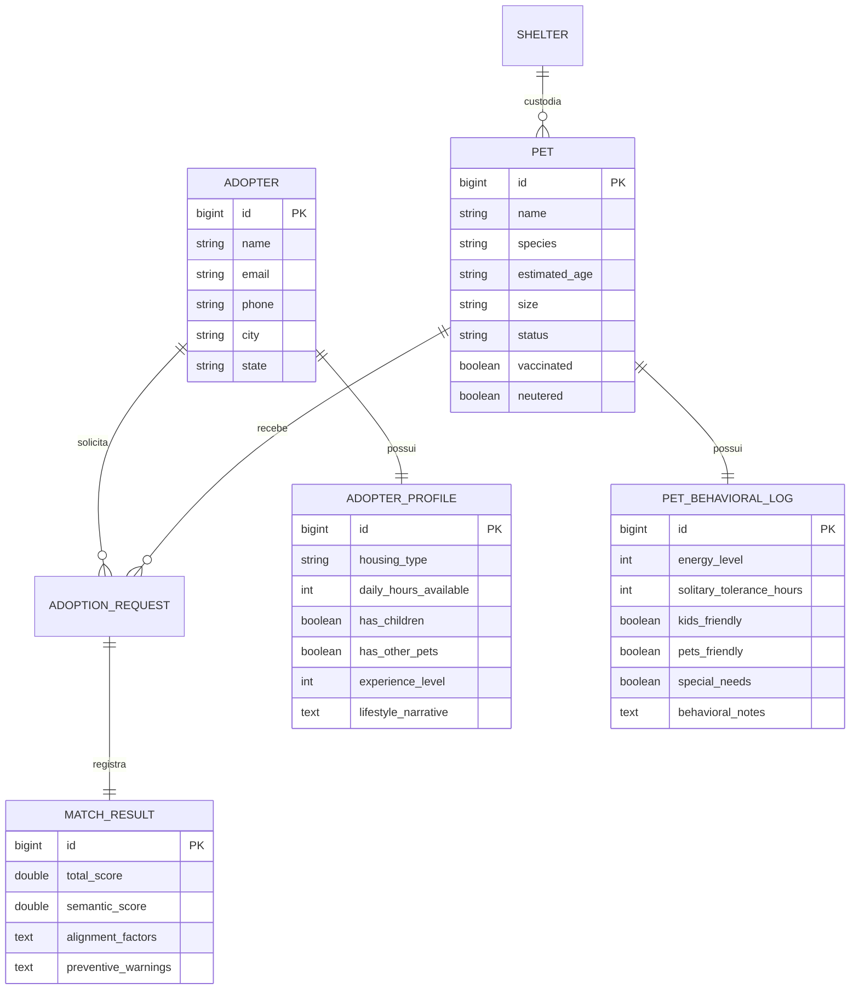

# Especificação 01 — Domínio de Negócio e Requisitos de Aplicação
## Projeto AdotaMatch — TLC Spec-Driven Development

---

## 1. Contexto e Motivação Social

O processo convencional de adoção de animais de estimação no Brasil baseia-se historicamente no modelo de "catálogo visual": o potencial adotante navega por fotografias de cães e gatos em redes sociais ou feiras presenciais, realizando uma escolha pautada em critérios estéticos imediatistas (porte, raça, pelagem ou filhote).

Esse processo ignora fatores cruciais para a convivência harmoniosa:
1. **Disponibilidade Real de Tempo:** Animais com alta demanda energética alocados em lares onde o tutor permanece ausente mais de 10 horas diárias.
2. **Ambiente Físico vs. Porte/Comportamento:** Animais de porte médio a grande ou com propensão a saltos alocados em apartamentos sem espaço para movimentação ou quintais sem muros adequados.
3. **Composição Familiar e Tolerância Social:** Animais com histórico de traumas ou reatividade alocados em lares com crianças pequenas ou outros animais conviventes.
4. **Falta de Conscientização Prévia:** Adotantes desinformados sobre o período natural de adaptação, custos veterinários e necessidades comportamentais do animal.

**Consequência:** Devolução do animal ao abrigo (muitas vezes após semanas ou meses), agravamento de traumas comportamentais do animal, frustração familiar e, no pior cenário, o reabandono nas ruas.

**Objetivo do AdotaMatch:** Inverter a lógica tradicional. O sistema prioriza a **compatibilidade ética de estilo de vida**, atuando como um filtro inteligente que recomenda animais adequados à rotina do tutor e educa o adotante sobre os desafios específicos do animal antes que o termo de adoção seja firmado.

---

## 2. Atores do Sistema

| Ator | Descrição e Papel no Sistema |
| :--- | :--- |
| **Adotante** | Pessoa física interessada em acolher um animal. Preenche seu perfil cadastral objetivo e sua narrativa de estilo de vida, consulta as recomendações ordenadas, lê as justificativas explicativas e solicita a intenção de adoção. |
| **ONG / Protetor Independente** | Entidade responsável pelo resgate e custódia dos animais. Cadastra os animais sob sua responsabilidade, alimenta os diários comportamentais e avalia os pedidos de adoção pré-qualificados pelo sistema. |
| **Motor AdotaMatch (AI Engine)** | Núcleo computacional que executa a filtragem de restrições rígidas, o alinhamento semântico via LLM, o cálculo ponderado e a síntese das justificativas preventivas. |

---

## 3. Entidades Fundamentais do Domínio

---

## 4. Requisitos Funcionais do Sistema (RF)

* **RF01 – Cadastro e Gestão de Animais:** Permitir que ONGs e protetores cadastrem animais com dados veterinários estruturados e o diário comportamental em texto livre.
* **RF02 – Perfilamento do Adotante:** Coletar dados domiciliares e de rotina do adotante, integrados a um relato aberto sobre seu estilo de vida e expectativas.
* **RF03 – Filtragem por Restrições Rígidas:** Eliminar automaticamente candidatos que violem condições inegociáveis (ex.: residência sem quintal para animal de porte gigante com hábito de fuga; animal com fobia atestada de crianças para lares com menores).
* **RF04 – Ranqueamento Ponderado Multicritério:** Calcular a pontuação de compatibilidade de cada animal elegível, combinando variáveis estruturadas e a afinidade contextual calculada via LLM.
* **RF05 – Síntese de Explicabilidade Preventiva:** Gerar, via LLM com prompt estruturado, a justificativa da recomendação dividida em *Fatores de Afinidade* e *Alertas Preventivos de Adaptação*.
* **RF06 – Manifestação de Interesse Responsável:** Permitir que o adotante solicite a abertura de processo de adoção somente após a visualização dos alertas preventivos de convivência.

---

## 5. Requisitos Não Funcionais (RNF)

* **RNF01 – Desempenho e Latência:** O tempo total para ranquear os candidatos disponíveis e retornar os Top-5 com justificativas não deve exceder 3,5 segundos sob carga normal.
* **RNF02 – Resiliência e Fallback:** Se a API do Modelo de Linguagem estiver indisponível ou registrar timeout, o sistema deve acionar o fallback heurístico determinístico, garantindo que o usuário receba a pontuação e explicações baseadas em regras de negócio.
* **RNF03 – Acessibilidade e Responsividade:** A interface web deve ser responsiva e legível em dispositivos móveis, com conformidade às diretrizes WCAG 2.1 nível AA.
* **RNF04 – Privacidade e LGPD:** Dados pessoais dos adotantes não devem ser compartilhados ou expostos antes do consentimento mútuo entre adotante e instituição de acolhimento.
