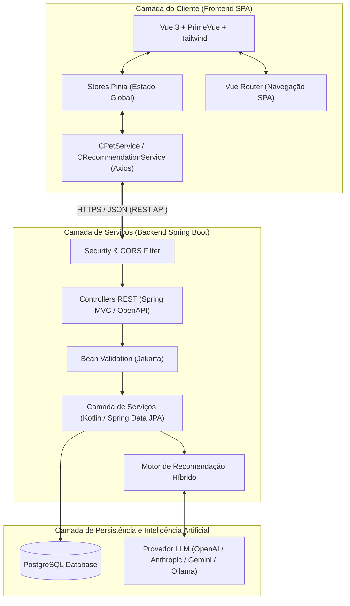
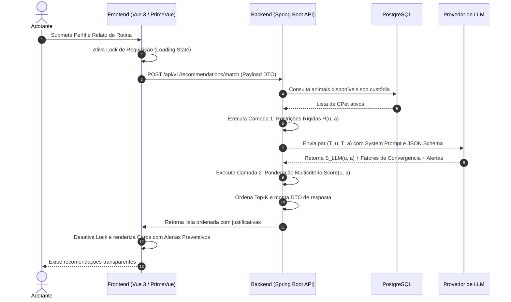

# Especificação 02 — Arquitetura Geral do Sistema
## Projeto AdotaMatch — TLC Spec-Driven Development

---

## 1. Visão Macro da Arquitetura

O **AdotaMatch** adota o paradigma de **Arquitetura Desacoplada Cliente-Servidor orientada a Serviços RESTful e SPA (Single Page Application)**. 

Esse arranjo assegura total independência entre a camada de apresentação visual (Frontend) e o motor de regras de negócio, persistência e orquestração de Inteligência Artificial (Backend).

---

## 2. Decisões Arquiteturais Fundamentais (ADRs)

### ADR 01: Adoção de SPA (Vue 3) desacoplada de API RESTful (Kotlin / Spring Boot)
* **Contexto:** Necessidade de permitir uma experiência interativa, reativa e sem recargas completas de tela para preenchimento de perfis e navegação por animais recomendados, facilitando futuras versões mobile (PWA ou aplicativo nativo).
* **Decisão:** O backend atua exclusivamente como provedor de APIs RESTful sem renderização de páginas no servidor (sem Thymeleaf/JSP).
* **Consequência:** Separação estrita de preocupações e possibilidade de evolução independente das interfaces.

### ADR 02: Motor Híbrido com Fallback Heurístico para LLMs
* **Contexto:** LLMs comerciais e modelos abertos podem sofrer com latência variável de rede, custos de token ou indisponibilidade de API.
* **Decisão:** O cálculo base e o descarte por restrições rígidas ocorrem deterministicamente no backend. A chamada à LLM é executada de forma assíncrona com timeout rigoroso. Caso a LLM não responda em até 5 segundos, ativa-se o módulo de fallback baseado em regras predefinidas, garantindo a entrega da recomendação.
* **Consequência:** Alta resiliência operacional (100% de disponibilidade da função principal do sistema).

### ADR 03: Governança Estrita de Tipos e Contratos
* **Contexto:** Prevenção de regressões e falhas de integração entre frontend e backend.
* **Decisão:** Todos os payloads de requisição e resposta são documentados com especificações JSON / OpenAPI e convertidos em interfaces fortemente tipadas no frontend (`models/`) e DTOs imutáveis no backend (`dto/`).

---

## 3. Fluxo de Execução da Recomendação (Pipeline de Dados)

