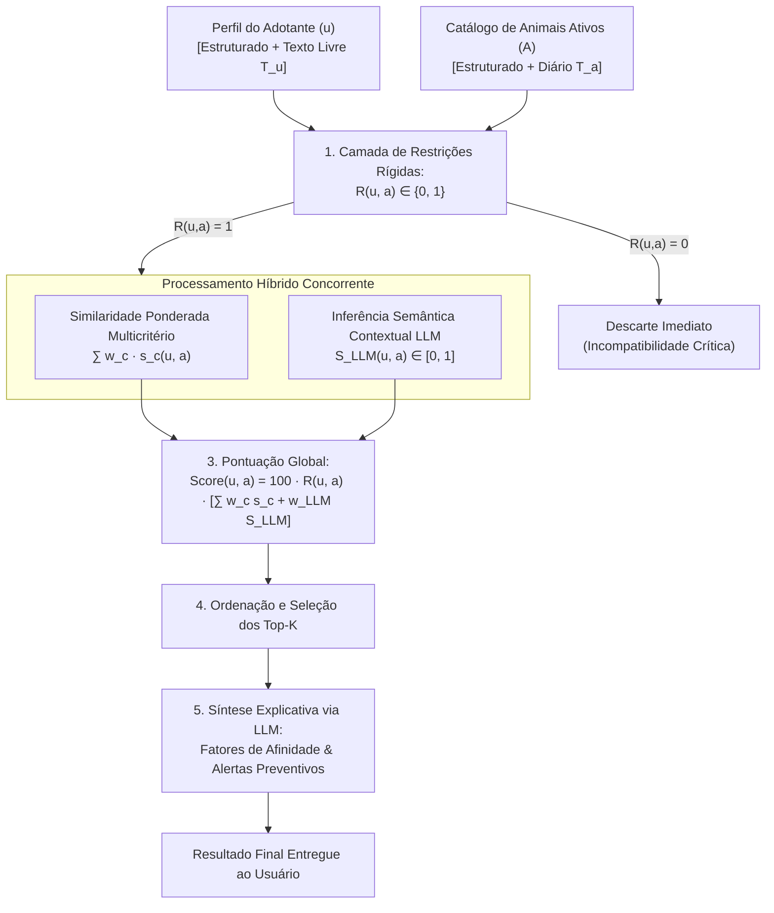

# Especificação 05 — Especificação do Motor Híbrido de Recomendação & LLM
## Projeto AdotaMatch — TLC Spec-Driven Development

---

## 1. Visão Geral do Motor Computacional

O motor de recomendação do AdotaMatch constitui o núcleo científico e tecnológico da aplicação, traduzindo formalmente o modelo apresentado na monografia acadêmica (`GersonFernandesRibeiro.docx`).

O sistema resolve um problema de **ranqueamento bidirecional e explicável** que cruza um vetor de adotante $u$ com um conjunto de candidatos animais $A = \{a_1, a_2, \dots, a_n\}$.



---

## 2. Formalização Matemática das Funções de Similaridade Estruturadas ($s_c$)

Cada função $s_c(u, a)$ é normalizada no intervalo $[0, 1]$:

### 2.1 Critério 1: Energia vs. Tempo Disponível ($w_1 = 0,20$)
* $E(a) \in \{1, 2, 3, 4, 5\}$ (Nível de energia do animal).
* $D(u) \in [1, 12]$ (Horas diárias dedicadas). Normalizado para escala discreta $1$ a $5$ mediante mapeamento:
  * $< 2h \rightarrow 1$; $2-3h \rightarrow 2$; $4-5h \rightarrow 3$; $6-7h \rightarrow 4$; $\ge 8h \rightarrow 5$.
* Função:
  $$s_1(u, a) = 1 - \frac{|E(a) - \text{norm}(D(u))|}{4}$$

### 2.2 Critério 2: Convivência Familiar ($w_2 = 0,15$)
* Se o adotante possui crianças ou outros animais:
  $$s_2(u, a) = \begin{cases} 
  1,0, & \text{se } \text{KidsOK}(a) = \text{true e } \text{PetsOK}(a) = \text{true} \\
  0,5, & \text{se requer adaptação supervisionada} \\
  0,0, & \text{se intolerante (e não eliminado pela camada rígida)}
  \end{cases}$$

### 2.3 Critério 3: Moradia vs. Porte ($w_3 = 0,15$)
* Mapeamento de espaço $Espaço(u) \in \{1, 2, 3, 4\}$ (Apartamento sem sacada, Apartamento com varanda, Casa com quintal pequeno, Casa com quintal amplo/Sítio).
* Porte do animal $P(a) \in \{1, 2, 3, 4\}$ (Mini, Pequeno, Médio, Grande/Gigante).
* Função:
  $$s_3(u, a) = 1 - \frac{|Espaço(u) - P(a)|}{3}$$

### 2.4 Critério 4: Permanência Solitária vs. Ausência ($w_4 = 0,15$)
* $T_{\text{sol}}(a)$ (horas toleradas) e $H_{\text{aus}}(u)$ (horas de ausência diária do tutor).
* Função:
  $$s_4(u, a) = \begin{cases}
  1,0, & \text{se } H_{\text{aus}}(u) \le T_{\text{sol}}(a) \\
  \max\left(0, 1 - \frac{H_{\text{aus}}(u) - T_{\text{sol}}(a)}{4}\right), & \text{se } H_{\text{aus}}(u) > T_{\text{sol}}(a)
  \end{cases}$$

### 2.5 Critério 5: Experiência vs. Cuidados Especiais ($w_5 = 0,15$)
* $Exp(u) \in \{1, 2, 3\}$ (Iniciante, Intermediário, Experiente).
* $C(a) \in \{1, 2, 3\}$ (Nenhum cuidado especial, Cuidados moderados, Tratamento contínuo/Complexo).
* Função:
  $$s_5(u, a) = \begin{cases}
  1,0, & \text{se } Exp(u) \ge C(a) \\
  \max(0, 1 - (C(a) - Exp(u)) \times 0,4), & \text{se } Exp(u) < C(a)
  \end{cases}$$

---

## 3. Engenharia de Prompts para Alinhamento Semântico e Explicabilidade

### 3.1 System Prompt (Ancoragem e Esquema JSON)
```text
Você é o motor de inteligência e explicabilidade do AdotaMatch, um sistema de Ciência da Computação focado em adoção responsável e prevenção de devoluções e reabandono de animais.

Sua tarefa é avaliar semanticamente o alinhamento entre o relato de estilo de vida do adotante e o diário comportamental do animal, gerando:
1. Um escore semântico normalizado (semanticScore) entre 0.00 e 1.00.
2. Uma lista de fatores objetivos de afinidade (alignmentFactors).
3. Uma lista de alertas preventivos de adaptação (preventiveWarnings), educando o adotante sobre os desafios reais da convivência.

REGRAS INEGOCIÁVEIS:
- Baseie-se estritamente nos dados fornecidos. Não invente comportamentos não descritos (alucinação zero).
- Seja honesto e empático: a segurança e o bem-estar do animal e da família estão em primeiro lugar.
- Responda OBRIGATORIAMENTE no formato JSON Schema abaixo.
```

### 3.2 JSON Schema de Resposta da LLM
```json
{
  "$schema": "http://json-schema.org/draft-07/schema#",
  "type": "object",
  "properties": {
    "semanticScore": {
      "type": "number",
      "minimum": 0.0,
      "maximum": 1.0
    },
    "alignmentFactors": {
      "type": "array",
      "items": { "type": "string" },
      "minItems": 1,
      "maxItems": 4
    },
    "preventiveWarnings": {
      "type": "array",
      "items": { "type": "string" },
      "minItems": 1,
      "maxItems": 4
    }
  },
  "required": ["semanticScore", "alignmentFactors", "preventiveWarnings"],
  "additionalProperties": false
}
```

---

## 4. Algoritmo de Fallback Heurístico

Em caso de falha de conexão ou timeout na chamada da LLM:
1. $w_{\text{LLM}} = 0,20$ é redistribuído proporcionalmente entre os critérios estruturados ($w_c' = w_c / 0,80$).
2. Os textos de justificativa são gerados por um gerador baseado em regras determinísticas a partir dos deltas $|s_c(u, a)|$.
3. Adiciona-se uma nota interna de telemetria registrando a execução em modo contingência para auditoria.
