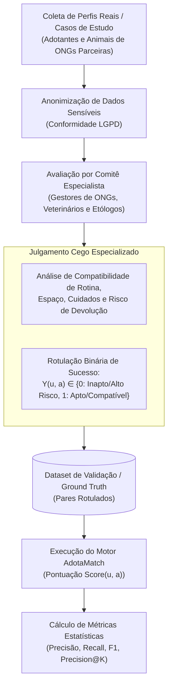
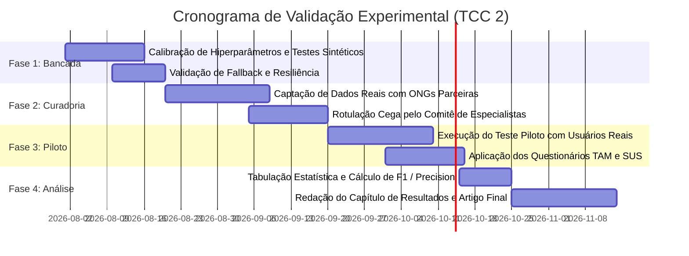

# Especificação 08 — Protocolo de Validação Experimental e Avaliação
## Projeto AdotaMatch — TLC Spec-Driven Development (Planejamento TCC 2)

---

## 1. Visão Geral e Propósito

Esta especificação define o **Protocolo de Validação Experimental** da plataforma **AdotaMatch**, em estrita conformidade com a Seção 5 do Trabalho de Conclusão de Curso em Ciência da Computação:
> **"ADOTAMATCH: SISTEMA DE RECOMENDAÇÃO BASEADO EM CONTEÚDO E MODELOS DE LINGUAGEM DE GRANDE PORTE (LLMs) PARA APOIO À ADOÇÃO RESPONSÁVEL DE ANIMAIS"** (UNIFAGOC, 2026).

Enquanto o TCC 1 concentra-se na concepção teórica, modelagem algorítmica, arquitetura de software e implementação dos núcleos funcionais, o TCC 2 executará os testes práticos de validação com dados reais de abrigos parceiros. Este documento padroniza a coleta de dados, a apuração estatística das métricas de recomendação e os instrumentos de avaliação de usabilidade e aceitação de tecnologia.

---

## 2. Construção do Dataset de Teste e Curadoria de *Ground Truth*

Para validar cientificamente se o sistema AdotaMatch é superior aos métodos de busca tradicionais na prevenção de incompatibilidades, será construído um conjunto de dados de referência (*Ground Truth*):

### 2.1 Critérios de Composição do Painel de Especialistas
* Pelo menos 3 avaliadores independentes com experiência mínima comprovada de 3 anos em triagem e adoção de animais em ONGs ou centros de acolhimento.
* Avaliação cega: os especialistas não têm conhecimento prévio das pontuações geradas pelo algoritmo do AdotaMatch.
* Em caso de divergência entre especialistas, adota-se o voto majoritário ou a média aritmética das notas de adequação.

---

## 3. Métricas Computacionais de Recomendação e Matriz de Confusão

A validação da acurácia algorítmica adota um limiar de corte $\theta = 70\%$ para a classificação binária de recomendabilidade ($1$ para recomendável, $0$ para não recomendável).

### 3.1 Definição da Matriz de Confusão

| Classificação Algorítmica | Realidade: Especialista = 1 (Apto) | Realidade: Especialista = 0 (Incompatível / Risco) |
|:---:|:---:|:---:|
| **Previsto Positivo ($\text{Score} \ge \theta$)** | **Verdadeiro Positivo ($TP$)** Match correto e seguro | **Falso Positivo ($FP$)** **Recomendação indevida (Risco de Devolução)** |
| **Previsto Negativo ($\text{Score} < \theta$)** | **Falso Negativo ($FN$)** Oportunidade de adoção suprimida | **Verdadeiro Negativo ($TN$)** Incompatibilidade barrada corretamente |

> [!CRITICAL]
> **Foco Científico na Minimização de Falsos Positivos ($FP$):**
> No domínio da adoção de animais, um **Falso Positivo** é infinitamente mais danoso do que um Falso Negativo. Indicar um animal incompatível pode resultar em traumas graves, agressões domésticas, devolução e reabandono. Logo, a métrica de **Precisão** ($\frac{TP}{TP + FP}$) e a especificidade do filtro rígido são as grandezas críticas do projeto.

### 3.2 Fórmulas Estatísticas Consolidadas (Powers, 2011)

1. **Acurácia Global:**
   $$\text{Acurácia} = \frac{TP + TN}{TP + TN + FP + FN}$$

2. **Precisão (Precision):**
   $$\text{Precisão} = \frac{TP}{TP + FP}$$

3. **Revocação (Recall / Sensibilidade):**
   $$\text{Recall} = \frac{TP}{TP + FN}$$

4. **F1-Score (Média Harmônica Ponderada):**
   $$\text{F1-Score} = 2 \times \frac{\text{Precisão} \times \text{Recall}}{\text{Precisão} + \text{Recall}}$$

5. **Precisão nos Top-K Resultados (Precision@K):**
   $$\text{Precision@K} = \frac{\sum_{i=1}^K \text{Relevante}(a_i)}{K}, \quad \text{onde } K \in \{1, 3, 5\}$$

---

## 4. Avaliação de Percepção Humana e Aceitação de Tecnologia (TAM — Davis, 1989)

O *Technology Acceptance Model* (TAM) avalia a intenção comportamental e a probabilidade de adoção contínua da ferramenta por ONGs e adotantes.

### 4.1 Construtos e Questionário Aplicado
O questionário utiliza escala Likert de 5 pontos (1 = Discordo Totalmente a 5 = Concordo Totalmente):

#### Construto A: Utilidade Percebida (Perceived Usefulness - PU)
* **PU-1:** O sistema AdotaMatch me ajudou a identificar incompatibilidades que eu não teria notado sozinho.
* **PU-2:** A visualização dos **Alertas Preventivos de Adaptação** aumentou minha segurança quanto aos desafios reais de rotina com o animal.
* **PU-3:** A lista de **Fatores de Afinidade** tornou o processo de escolha mais claro e objetivo do que fotos soltas em redes sociais.
* **PU-4:** A ferramenta economiza tempo na triagem de adoção em comparação a questionários estáticos convencionais.

#### Construto B: Facilidade de Uso Percebida (Perceived Ease of Use - PEOU)
* **PEOU-1:** O preenchimento do questionário de perfil socioambiental é intuitivo e sem ambiguidades.
* **PEOU-2:** Entendi com facilidade o significado da pontuação de compatibilidade percentual.
* **PEOU-3:** Foi simples navegar pelos perfis dos animais e visualizar as justificativas detalhadas.
* **PEOU-4:** Não precisei de ajuda de terceiros para concluir todo o fluxo de recomendação.

---

## 5. Avaliação Padronizada de Usabilidade via Escala SUS (Brooke, 1996)

A *System Usability Scale* (SUS) é o padrão internacional normatizado para mensuração de usabilidade de interfaces de software.

### 5.1 O Instrumento das 10 Afirmações Oficiais
Os respondentes avaliam as 10 afirmações em escala Likert de 1 a 5:

1. Eu acho que gostaria de usar este sistema com frequência. *(Positiva)*
2. Eu achei o sistema desnecessariamente complexo. *(Negativa)*
3. Eu achei o sistema fácil de usar. *(Positiva)*
4. Eu acho que precisaria de ajuda de uma pessoa com conhecimentos técnicos para usar este sistema. *(Negativa)*
5. Eu achei que as várias funções deste sistema estavam muito bem integradas. *(Positiva)*
6. Eu achei que havia muitas inconsistências neste sistema. *(Negativa)*
7. Eu imagino que a maioria das pessoas aprenderia a usar este sistema muito rapidamente. *(Positiva)*
8. Eu achei o sistema muito incômodo / complicado de utilizar. *(Negativa)*
9. Eu me senti muito confiante ao usar o sistema. *(Positiva)*
10. Eu precisei aprender muitas coisas novas antes de conseguir mexer no sistema. *(Negativa)*

### 5.2 Algoritmo Canônico de Pontuação da Escala SUS

Seja $R_i \in \{1, 2, 3, 4, 5\}$ a resposta dada pelo usuário ao item $i$:

* Para itens com número **ímpar** ($i \in \{1, 3, 5, 7, 9\}$):
  $$C_i = R_i - 1$$
* Para itens com número **par** ($i \in \{2, 4, 6, 8, 10\}$):
  $$C_i = 5 - R_i$$

A pontuação final SUS individual ($S_{\text{SUS}} \in [0, 100]$) é obtida pela multiplicação da soma dos escores normalizados por $2,5$:
$$S_{\text{SUS}} = 2,5 \times \sum_{i=1}^{10} C_i$$

### 5.3 Critério de Aceitação de Usabilidade
* **Meta Científica do Projeto:** Obter escore médio $\ge 75$ pontos na amostra de teste (classificação de grau **A / Excelente** na régua de Bangor et al., 2008).

---

## 6. Roteiro e Cronograma Operacional para Execução no TCC 2

1. **Fase 1 (Calibração em Bancada):** Testes de estresse com massa de dados sintética parametrizada, verificando convexidade de pesos e estabilidade das chamadas da LLM.
2. **Fase 2 (Curadoria de Campo):** Parceria formalizada com ONGs acolhedoras locais para cadastro de ao menos 50 perfis reais de animais e coleta de casos históricos de adoção e devolução.
3. **Fase 3 (Teste Piloto com Usuários):** Disponibilização da aplicação em ambiente de *staging* para grupo amostral de pelo menos 30 potenciais adotantes e 10 voluntários de ONGs.
4. **Fase 4 (Análise e Defesa):** Consolidação dos índices de precisão, escores SUS e apresentação conclusiva dos dados empíricos para a banca examinadora de graduação.
